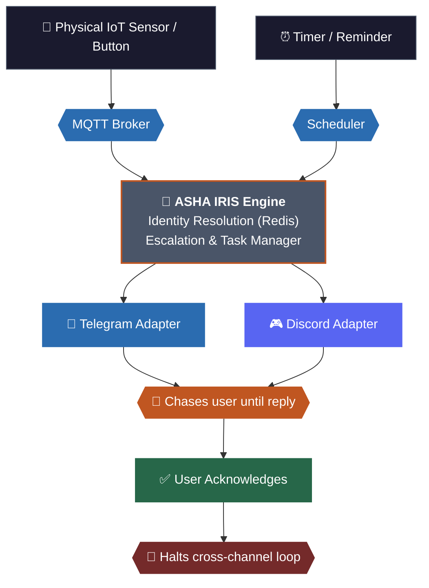

# Asha Iris

An AI secretary who reaches people over Telegram and Discord on your behalf, remembers who they are across both, and can watch for real-world events — or just a timer — and proactively chase someone down until they respond.

Built with the [Caspian SDK](https://trycaspianai.com) — one identity, one handler, every channel.

## The problem

Reaching someone reliably means picking the right channel and hoping they check it. Watching for something (a sensor, a webhook, a deadline) and making sure a human actually sees it — retrying elsewhere if the first attempt goes unanswered — normally means hand-wiring a separate integration per platform, each with its own auth and no shared memory between them.

## The solution

Iris is a single agent that sits in front of every channel at once. Tell her who to reach and what to say; she remembers you as one identity no matter which platform you're on. Give her a standing instruction, hook up a real-world event, or just ask her to remind you about something — she'll notify the right contact and keep retrying across channels until someone actually responds.

## Try it

**Website:** [ashairis.vercel.app](https://ashairis.vercel.app) — links, an MCP URL to paste into Claude/any MCP client, and a live demo prompt.

**Telegram:** [@iris_caam_bot](https://t.me/iris_caam_bot) — say hi, then try: *"remind me in 5 minutes to check on something, and don't stop trying until I reply."*

**Discord:** [invite the bot](https://discord.com/oauth2/authorize?client_id=1535039012346011708&permissions=0&integration_type=0&scope=bot)

## How it works, briefly

- **CAAM** (Caspian as an MCP) — Iris's messaging layer is its own MCP server, so any agent (Claude, Copilot, your own) can send through it, not just Iris.
- **The agent** — one Caspian handler receives messages from every connected channel, resolves a single identity for the sender, and replies with full cross-channel memory.
- **Escalation** — a task (from an MQTT event, or `set_reminder`) triggers the same retry loop either way: notify, wait, retry across channels, stop once someone responds.
- **IoT (optional)** — pairs with [ashaBackend](https://github.com/pius-code/ashaBackend) to let Iris react to real sensors and hardware, not just messages and timers.

---

## Setup (for cloning and running it yourself)

1. Clone and `cd` into the repo.
2. Install dependencies: `uv sync` (requires Python 3.11+).
3. Have a local Redis instance running (`localhost:6379`, db 0) — used for contacts, identities, history, and tasks.
4. Copy `.env.example` to `.env` and fill in your own values (see below).
5. Run: `uv run main.py`.

This starts everything in one process: the Caspian listener (Telegram + Discord), the MQTT listener, the reminder scheduler, and an MCP server at `http://127.0.0.1:8000/mcp` exposing Iris's tools to any external MCP client.

### Environment variables

| Variable | Used for |
| --- | --- |
| `CASPIAN_API_KEY` | Caspian SDK auth |
| `CASPIAN_BASE_URL` | Caspian SDK base URL |
| `Telegram_bot` | Telegram bot token |
| `DISCORD_BOT_TOKEN` | Discord bot token |
| `CAAM_MCP` | URL of Iris's own MCP server (typically `http://127.0.0.1:8000/mcp`, i.e. itself) |
| `ASHA_MCP` | URL of the `ashaBackend` MCP server, if using the IoT side , ignore otherwise|
| `MQTT_IP` / `MQTT_PORT` | MQTT broker Iris listens on for external events — must match whatever `ashaBackend`/your device actually publishes to |
| `GROQ_API_KEY` | Groq API key — Iris's default model runs via Groq's OpenAI-compatible endpoint |
| `OPEN_ROUTER_KEY` | OpenRouter API key (alternate model client; optional) |

You don't need every provider listed — pick one model client you're comfortable with and leave the rest blank.

### Tools

| Tool | Where | Description |
| --- | --- | --- |
| `create_identity` | local, closed over the current conversation | Links a new channel to the sender's identity. Not reachable externally — only Iris's own agent loop uses it. |
| `send_message` | MCP (CAAM) | Sends a message to a known contact on Telegram or Discord. |
| `create_unresolved_task` | MCP (CAAM) | Creates an escalation task tied to a future external (MQTT) event. |
| `set_reminder` | MCP (CAAM) | Creates the same kind of escalation task, triggered by a timer instead of an event — "remind me in N minutes/hours." |

### Project structure

main.py Entry point — wires Caspian, MQTT, the reminder scheduler, and the MCP server together
core/
casp.py Caspian client, connected to Telegram + Discord
fastmcp.py FastMCP server instance
mqtt.py MQTT client, subscribed to asha-iris/events/#
agent/
client.py Model clients (Groq, OpenRouter) and model name constants
mcp_client.py The agent loop — identity resolution, history, tool wiring
tools/
tools.py MCP-exposed tools: send_message, create_unresolved_task, set_reminder
handler/
event_handler.py Routes an MQTT event to a one-off agent run or the retry loop
retry_handler.py Retries notifying a contact up to max_attempts, on a delay
reminder_scheduler.py Polls for due reminders, hands them to the same retry loop
utils/
redis.py All Redis-backed state: contacts, identities, history, tasks
pseudo.py Builds a synthetic message for non-conversational (MQTT/reminder) triggers
website/
index.html Static landing page (deployed separately, e.g. Vercel)

### How a message flows through the system

1. A message arrives on any connected channel → Caspian fires the single `handle()` callback in `main.py`.
2. `store_contact` saves the sender's delivery info; `resolve_matching_task` checks if this reply resolves an in-flight task.
3. `agent(message)` resolves the sender's identity (spanning every linked channel), loads that identity's full history, and replies — able to call `send_message`, `create_unresolved_task`, `set_reminder`, or `create_identity`.
4. The reply is saved back into that identity's history and sent back.

Separately, MQTT events and due reminders both funnel into the exact same `start_retry_loop` — notify, wait, retry across channels up to `max_attempts`, stop on reply.

## Known limitations / roadmap

- **Redis is temporary storage.** Post-hackathon, this should move to a persistent database.
- **Identity linking only works one direction.** A channel can only get linked by messaging from a channel Iris *already* recognizes. Showing up cold on a brand-new channel first always creates a separate identity.
- **No verification before linking a channel.** Telling Iris "my email is X" links it on say-so alone, with no proof of ownership. Should be fixed by verifying before linking, not trusting the claim outright.
- **No cross-channel summarization yet.** History replays in full on every turn — fine at this scale, not at real scale.
- **Proactive email delivery is unreliable.** Replies work fine; proactively pushing a new message into an existing email conversation reports success from Caspian's API but doesn't reliably land — likely a platform-side gap, not something fixable here. Email is kept as an unoffered fallback rather than a primary channel for this reason.
- **Reminders only support a one-shot delay, not recurring schedules** ("remind me every day at 8am") — would need a cron-based path added alongside the current timestamp-based one.
